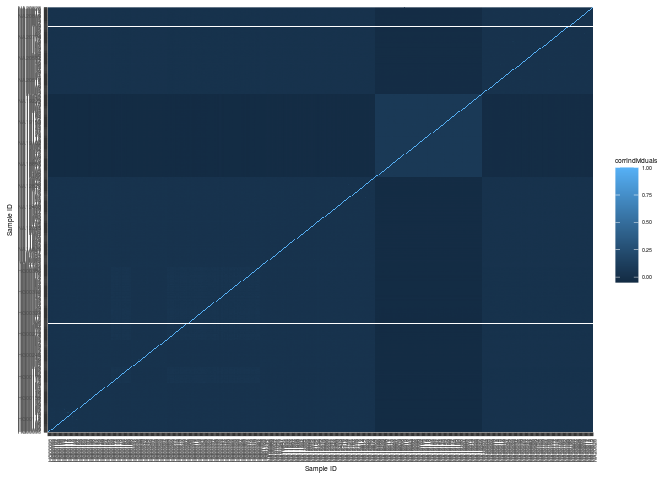
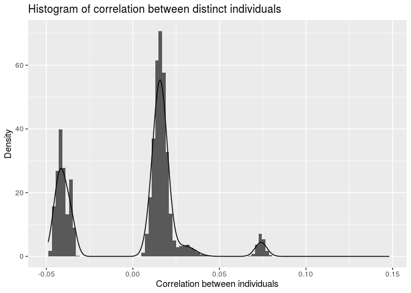
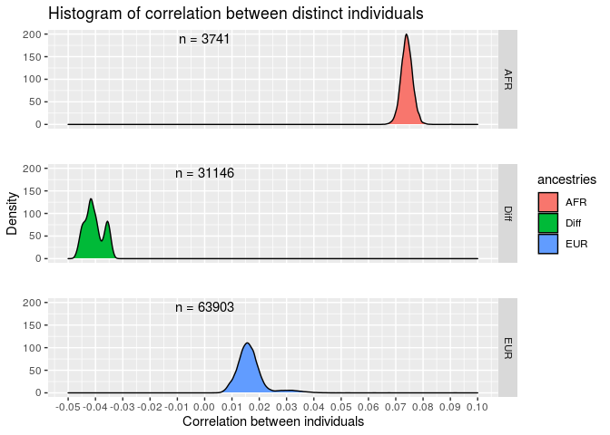
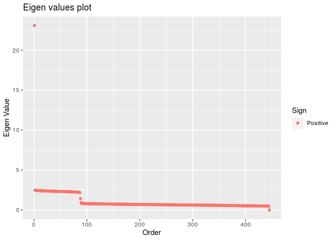
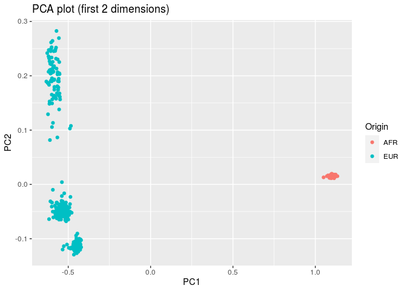

First Estimates
================
Lucas Ramalho Anderson
21/10/2020

``` r
library ( dplyr )
# library ( plyr )
library ( ggplot2 )

tempDir = "/scratch/genevol/users/lucas/"
saveDir = "/raid/genevol/users/lucas/heritability/plots/"
```

Introduction
------------

Step 1
------

After the removal of monomorphisms, filtration of the desired samples and after obtaining the list of non-correlated snp's per chromosome (considering correlation value of \(\sqrt{0.1}\)), it is now desired to calculate the GRM matrix.

``` r
# Read file with all chromosomes
# allChrFile = SeqArray::seqOpen ( paste0 ( tempDir , "allChr.gds" ) )
# List of all genes of interest (after pruning)
listSnps = readRDS ( paste0 ( tempDir , "fullPrunedList.rds" ) )

# GRM - calculated as defined in CGTA
# grm_obj = SNPRelate::snpgdsGRM( allChrFile , snp.id = listGenes , method = "GCTA")

# Estimating through "gaston" package
altReadSnps = gaston::read.vcf( paste0 ( tempDir , "allChr.vcf.gz" ) )
```

    ## ped stats and snps stats have been set. 
    ## 'p' has been set. 
    ## 'mu' and 'sigma' have been set.

``` r
# setting "p" parameter - correction with mean "p" and std sqrt(2p(1-2p))
gaston::standardize( altReadSnps ) <- "p"
grm_matrix = gaston::as.matrix ( altReadSnps )
# grm_scaled = scale( grm_matrix , center = T , scale = T )
# grm_scaled = readRDS (paste0(tempDir , "scaledMatrixBk.rds"))


# manual_GRM = ( 1 / nrow ( grm_scaled ) ) * grm_scaled %*% t ( grm_scaled )
# GRM matrix calculation (GCTA)
grm_alt_p = gaston::GRM ( altReadSnps , which.snps = listSnps )
```

    ## Warning in which.snps & is.autosome(x@snps$chr): longer object length is not a
    ## multiple of shorter object length

``` r
# transform matrix into dataframe (3 columns - col1 = samples each row, col2 = samples each column ,  col3 = values for each pair)
dfGrm = reshape2::melt(grm_alt_p)

# indexing with numeric values each sample (columns and rows)
# dfGrm$sampLines = rep ( seq ( 1 , nrow ( grm_alt_p ) ) , nrow ( grm_alt_p ) ) 
# dfGrm$sampCols = sort ( rep ( seq ( 1 , nrow ( grm_alt_p ) ) , nrow ( grm_alt_p ) ) )


# To calculate the correlation between individuals, the calculation A_ij/sqrt(A_ii)sqrt(A_jj) will be done
# dataframe with only diag. values
dfGrmDiag = dfGrm[ dfGrm$Var1 == dfGrm$Var2,]
# sqrt of those values
dfGrmDiag = dfGrmDiag %>% mutate ( sqrtVal = sqrt ( value ) , sqrtVal2 = sqrt ( value ) )

# merging each A_ii for each row and col
dfGrmM = merge ( dfGrm , dfGrmDiag[ ,c ( "sqrtVal" , "Var1" ) ] , on = c ( "Var1" ) )
dfGrmM2 = merge ( dfGrmM , dfGrmDiag[ ,c ( "sqrtVal2" , "Var2" ) ] , on = c ( "Var2" ) )

# Calculating A_ij/(sqrt(A_ii)sqrt(A_jj))
dfGrmFinal = dfGrmM2 %>% mutate ( corrIndividuals = value / ( sqrtVal * sqrtVal2 ) ) %>% arrange ( Var1 , Var2 )

# plot heatmap - correlation between individuals
dfGrmFinal %>% ggplot( aes ( x = Var1 , y = Var2 , fill = corrIndividuals ) ) + 
geom_tile() +
theme( axis.text.x = element_text(angle = 90, hjust = 1) , text = element_text (size = 5) ) +
labs ( x = "Sample ID" , y = "Sample ID" )
```



``` r
# It seems there are blocks with higher correlation between individuals between the samples

# Filter of all correlation values between individuals
dfUniqueCorr = dfGrmFinal %>% filter ( corrIndividuals < .9999 ) %>% distinct ( corrIndividuals , .keep_all = TRUE)

# Histogram and density of correlation values
dfUniqueCorr %>% ggplot ( aes ( x = corrIndividuals ) ) +
geom_histogram ( aes(y=..density..) , bins = 100 ) +
geom_density ( ) +
labs ( x = "Correlation between individuals" , y = "Density" , title = "Histogram of correlation between distinct individuals" )
```



``` r
# The correlation blocks are bolder in this plot 

# Readind file with HLA expressions and ancestry information
hlaExp = readr::read_tsv("/raid/genevol/heritability/hla_expression.tsv")
```

    ## Parsed with column specification:
    ## cols(
    ##   subject_id = col_character(),
    ##   continental_pop = col_character(),
    ##   population = col_character(),
    ##   sex = col_character(),
    ##   gene_name = col_character(),
    ##   NumReads = col_double(),
    ##   TPM = col_double()
    ## )

``` r
# Ancestry of all samples
ancestry = unique ( hlaExp[ , c ( "subject_id" , "continental_pop" )] )

# Merging ancestry info with correlation dataframe
check = merge ( dfUniqueCorr , ancestry , by.x = c ( "Var1" ) , by.y = c ( "subject_id" ) )
check2 = merge ( check , ancestry , by.x = c ( "Var2" ) , by.y = c ( "subject_id" ) )

tableAncestry = unique ( check[,c("continental_pop" , "Var1")] ) %>% select ( continental_pop ) %>% table() %>% as.data.frame ( ) %>%  mutate ( relFreq = paste0 ( 100 * round ( Freq / sum ( Freq ) , 4 ) , "%") ) %>% rename ( "Ancestry" = "." )

knitr::kable( tableAncestry )
```

| Ancestry |  Freq| relFreq |
|:---------|-----:|:--------|
| AFR      |    87| 19.59%  |
| EUR      |   357| 80.41%  |

``` r
# Approximately 20% of the 444 individuals are African, while the other 80% are European


# Checking the amount of comparisons between individuals with same ancestry and different ones
checkFin = check2 %>% mutate ( ancestries = ifelse ( continental_pop.x == continental_pop.y , continental_pop.x , "Diff" ) )


tableComparisons = table ( checkFin$ancestries ) %>% as.data.frame() %>% mutate ( freqRel = Freq/ sum ( Freq ) ) %>% rename ( "Ancestry" = "Var1" , "NumComparisons" = "Freq" )

knitr::kable ( tableComparisons )
```

| Ancestry |  NumComparisons|    freqRel|
|:---------|---------------:|----------:|
| AFR      |            3741|  0.0378682|
| Diff     |           31146|  0.3152748|
| EUR      |           63903|  0.6468570|

``` r
numComparisons = plyr::ddply(.data=checkFin, 
                 "ancestries", 
                 summarize, 
                 n=paste("n =", length(corrIndividuals)))

checkFin %>% ggplot ( aes ( x = corrIndividuals , fill =  ancestries ) ) +
    geom_density ( ) +
    facet_grid ( ancestries~. ) +
    theme(panel.spacing = unit (2, "lines") ) +
    labs ( x = "Correlation between individuals" , y = "Density" , title = "Histogram of correlation between distinct individuals" ) +
  geom_text(data=numComparisons, aes(x=0, y=190, label=n), 
                    colour="black", inherit.aes=FALSE, parse=FALSE) +
  scale_x_continuous ( breaks = seq ( from = -0.05 , to = 0.1 , by = 0.01 ) , limits = c( -0.05 , 0.1 ) )
```

    ## Warning: Removed 2 rows containing non-finite values (stat_density).



``` r
# display individuals with correlation greater than 10% in the sample
listGreatCorr = checkFin[ ( checkFin$corrIndividuals > .1 ) & ( checkFin$corrIndividuals < .999 ) , ] %>% distinct( corrIndividuals , .keep_all = TRUE)

listGreatCorr
```

<script data-pagedtable-source type="application/json">
{"columns":[{"label":["Var2"],"name":[1],"type":["fctr"],"align":["left"]},{"label":["Var1"],"name":[2],"type":["fctr"],"align":["left"]},{"label":["value"],"name":[3],"type":["dbl"],"align":["right"]},{"label":["sqrtVal"],"name":[4],"type":["dbl"],"align":["right"]},{"label":["sqrtVal2"],"name":[5],"type":["dbl"],"align":["right"]},{"label":["corrIndividuals"],"name":[6],"type":["dbl"],"align":["right"]},{"label":["continental_pop.x"],"name":[7],"type":["chr"],"align":["left"]},{"label":["continental_pop.y"],"name":[8],"type":["chr"],"align":["left"]},{"label":["ancestries"],"name":[9],"type":["chr"],"align":["left"]}],"data":[{"1":"HG00120","2":"HG00116","3":"0.09008908","4":"0.7819052","5":"0.7784340","6":"0.1480118","7":"EUR","8":"EUR","9":"EUR"},{"1":"HG00240","2":"HG00238","3":"0.07855233","4":"0.7790443","5":"0.7979105","6":"0.1263696","7":"EUR","8":"EUR","9":"EUR"}],"options":{"columns":{"min":{},"max":[10]},"rows":{"min":[10],"max":[10]},"pages":{}}}
  </script>

``` r
# grm = grm_alt_p
# rownames ( grm ) = altReadSnps
# colnames ( grm ) = altReadSnps$sample.id

correlationMatrix = reshape2::dcast(dfGrmFinal, Var1~Var2 , value.var = "corrIndividuals")
rownames ( correlationMatrix ) = correlationMatrix$Var1
correlationMatrix$Var1 = NULL

eigenValuesGrm = eigen ( correlationMatrix )
dfEigen = eigenValuesGrm$values %>% 
as.data.frame ( ) %>% 
mutate ( order = 1:445 ) %>%  
rename ( "Value" = '.' ) %>%
mutate ( neg = ifelse ( Value < 0 , "Negative" , "Positive" ) )


dfEigen %>% ggplot ( aes ( x = order , y = Value , colour = neg )  ) + 
geom_point ( ) +
labs ( x = "Order" , y = "Eigen Value" , title = "Eigen values plot" , colour = "Sign" )
```



``` r
# matrixCorrection = eigenValuesGrm$vectors %*% diag( eigenValuesGrm$values + abs ( min ( eigenValuesGrm$values ) ) ) %*% t ( eigenValuesGrm$vectors )
# rownames ( matrixCorrection ) = grm_obj$sample.id
# colnames ( matrixCorrection ) = grm_obj$sample.id

# rownames ( matrixCorrection ) = rownames ( grm )
# colnames ( matrixCorrection ) = colnames ( grm )


# eigenCorr = eigen ( matrixCorrection )

# dfEigenCorr = eigenCorr$values %>% 
  # as.data.frame ( ) %>% 
  # mutate ( order = 1:n() ) %>%  
  # rename ( "Value" = '.' ) %>%  
  # mutate ( neg = ifelse ( Value < 0 , "Negative" , "Positive" ) )
  

# dfEigenCorr %>% ggplot ( aes ( x = order , y = Value , colour = neg )  ) + 
#   geom_point ( ) +
#   labs ( x = "Order" , y = "Eigen Value" , title = "Eigen values plot" , colour = "Sign" )
```

``` r
expressionInterest = hlaExp %>% filter ( subject_id %in% colnames ( correlationMatrix ) )

mainInfo = expressionInterest %>% distinct( subject_id , continental_pop ,population )
numEigen = 2
print ( paste0 ( "Total variation explained by the first ", numEigen , " eigen values: " , 100*round ( sum ( eigenValuesGrm$values[1:numEigen] )/ sum ( eigenValuesGrm$values ) , 4 ) , "%" ) )
```

    ## [1] "Total variation explained by the first 2 eigen values: 3.75%"

``` r
vectors_ = eigenValuesGrm$vectors[,1:numEigen]
calcScores = as.matrix ( correlationMatrix , ncol = 445 )  %*% vectors_ %>% 
  as.data.frame() %>% 
  rename ( "PC1" = "V1" , "PC2" = "V2" ) %>% 
  mutate ( subject_id = rownames ( correlationMatrix ) )
pcaPlot = merge ( mainInfo , calcScores )

pcaPlot %>% ggplot ( aes ( x = PC1 , y = PC2  , colour = continental_pop ) ) +
  geom_point ( ) +
  labs ( title = "PCA plot (first 2 dimensions)" , colour = "Origin" )
```



``` r
  # geom_text ( )
```

``` r
simpleModels = function ( exp_ , df ){
  
  dfFilter = df  %>% filter ( gene_name == exp_ )
  
  fixed0 = lm ( TPM ~ 1 , data = dfFilter )
  sum0 = summary ( fixed0 )
  fixedEffectSigma = sum0$sigma^2

  mixedModel = coxme::lmekin( dfFilter$TPM ~ 1 + (1|dfFilter$subject_id) , data=dfFilter, varlist=list(as.matrix ( correlationMatrix , ncol = 445 ) ), vinit=2)
  
  mixedEffectSigma = mixedModel$sigma^2
  sigmaA = as.numeric(mixedModel$vcoef)
  
  # comparison = mixedEffectSigma/fixedEffectSigma
  
  # h = sigmaA / ( sigmaA + mixedEffectSigma)
  
  
  modelExpanded = coxme::lmekin( dfFilter$TPM ~ 1 + dfFilter$PC1 + dfFilter$PC2 + (1|dfFilter$subject_id), data=dfFilter, varlist=list(as.matrix ( correlationMatrix , ncol = 445 ) ), vinit=2)

  mixedEffectSigmaExp <- modelExpanded$sigma^2
  # comparisonExp = modelExpanded/fixedEffectSigma
  sigmaAExp = as.numeric(modelExpanded$vcoef)
  
  # hExp = sigmaAExp / (sigmaAExp + mixedEffectSigmaExp )
  
  return ( c ( exp_ , fixedEffectSigma , mixedEffectSigma , sigmaA , mixedEffectSigmaExp , sigmaAExp ) )
  
}

listNames = unique ( expressionInterest$gene_name )
modelDf = merge ( expressionInterest , calcScores )

requiredInfo = NULL
for ( name_ in listNames ){
  
  requiredInfo = rbind ( requiredInfo , simpleModels ( exp_ = name_ ,df = modelDf ) )
  
}

finalDf = requiredInfo %>% as.data.frame ( ) %>% rename ("Gene" = "V1" , 
                                                          "fixedSigma" = "V2" ,
                                                          "residualMixedSigma" = "V3" , 
                                                          "randomEffectSigma" = "V4",
                                                          "residualMixedSigmaExp" = "V5" ,
                                                          "randomEffectSigmaExp" = "V6") %>%
mutate ( fixedSigma = as.numeric ( as.character ( fixedSigma ) ) ,
    residualMixedSigma = as.numeric ( as.character (residualMixedSigma)) ,
    randomEffectSigma =  as.numeric ( as.character (randomEffectSigma)) ,
    residualMixedSigmaExp = as.numeric ( as.character (residualMixedSigmaExp)),
    randomEffectSigmaExp = as.numeric ( as.character (randomEffectSigmaExp))
    ) %>%
  mutate ( comparisonNull = residualMixedSigma/fixedSigma , 
           comparisonNullExp = residualMixedSigmaExp/fixedSigma ,
           hSimple = randomEffectSigma / ( randomEffectSigma + residualMixedSigma ) ,
           hExpanded = randomEffectSigmaExp / ( randomEffectSigmaExp + residualMixedSigmaExp ))

finalDf %>% knitr::kable()
```

<table>
<colgroup>
<col width="6%" />
<col width="7%" />
<col width="12%" />
<col width="11%" />
<col width="14%" />
<col width="13%" />
<col width="9%" />
<col width="11%" />
<col width="6%" />
<col width="6%" />
</colgroup>
<thead>
<tr class="header">
<th align="left">Gene</th>
<th align="right">fixedSigma</th>
<th align="right">residualMixedSigma</th>
<th align="right">randomEffectSigma</th>
<th align="right">residualMixedSigmaExp</th>
<th align="right">randomEffectSigmaExp</th>
<th align="right">comparisonNull</th>
<th align="right">comparisonNullExp</th>
<th align="right">hSimple</th>
<th align="right">hExpanded</th>
</tr>
</thead>
<tbody>
<tr class="odd">
<td align="left">HLA-A</td>
<td align="right">180900.15</td>
<td align="right">0.0000000</td>
<td align="right">Inf</td>
<td align="right">0.000000e+00</td>
<td align="right">1.100328e+56</td>
<td align="right">0.00e+00</td>
<td align="right">0.0000000</td>
<td align="right">NaN</td>
<td align="right">1.0000000</td>
</tr>
<tr class="even">
<td align="left">HLA-B</td>
<td align="right">526383.05</td>
<td align="right">0.0000000</td>
<td align="right">Inf</td>
<td align="right">0.000000e+00</td>
<td align="right">1.005852e+13</td>
<td align="right">0.00e+00</td>
<td align="right">0.0000000</td>
<td align="right">NaN</td>
<td align="right">1.0000000</td>
</tr>
<tr class="odd">
<td align="left">HLA-C</td>
<td align="right">127438.40</td>
<td align="right">0.0000000</td>
<td align="right">128722.67</td>
<td align="right">1.240047e+05</td>
<td align="right">1.001000e-04</td>
<td align="right">0.00e+00</td>
<td align="right">0.9730559</td>
<td align="right">1.0000000</td>
<td align="right">0.0000000</td>
</tr>
<tr class="even">
<td align="left">HLA-DPA1</td>
<td align="right">31587.29</td>
<td align="right">0.2816560</td>
<td align="right">31313.48</td>
<td align="right">0.000000e+00</td>
<td align="right">3.346782e+04</td>
<td align="right">8.90e-06</td>
<td align="right">0.0000000</td>
<td align="right">0.9999910</td>
<td align="right">1.0000000</td>
</tr>
<tr class="odd">
<td align="left">HLA-DPB1</td>
<td align="right">37625.10</td>
<td align="right">0.3677982</td>
<td align="right">33857.19</td>
<td align="right">3.122143e-01</td>
<td align="right">3.329876e+04</td>
<td align="right">9.80e-06</td>
<td align="right">0.0000083</td>
<td align="right">0.9999891</td>
<td align="right">0.9999906</td>
</tr>
<tr class="even">
<td align="left">HLA-DQA1</td>
<td align="right">51654.46</td>
<td align="right">0.3729824</td>
<td align="right">50052.43</td>
<td align="right">0.000000e+00</td>
<td align="right">1.256190e+08</td>
<td align="right">7.20e-06</td>
<td align="right">0.0000000</td>
<td align="right">0.9999925</td>
<td align="right">1.0000000</td>
</tr>
<tr class="odd">
<td align="left">HLA-DQB1</td>
<td align="right">38524.93</td>
<td align="right">0.4305301</td>
<td align="right">38836.22</td>
<td align="right">3.042733e-01</td>
<td align="right">3.880878e+04</td>
<td align="right">1.12e-05</td>
<td align="right">0.0000079</td>
<td align="right">0.9999889</td>
<td align="right">0.9999922</td>
</tr>
<tr class="even">
<td align="left">HLA-DRA</td>
<td align="right">390199.52</td>
<td align="right">4.3764783</td>
<td align="right">382198.84</td>
<td align="right">3.346605e+00</td>
<td align="right">3.799972e+05</td>
<td align="right">1.12e-05</td>
<td align="right">0.0000086</td>
<td align="right">0.9999885</td>
<td align="right">0.9999912</td>
</tr>
<tr class="odd">
<td align="left">HLA-DRB1</td>
<td align="right">148507.21</td>
<td align="right">1.3197049</td>
<td align="right">130126.27</td>
<td align="right">1.855803e+00</td>
<td align="right">1.275805e+05</td>
<td align="right">8.90e-06</td>
<td align="right">0.0000125</td>
<td align="right">0.9999899</td>
<td align="right">0.9999855</td>
</tr>
</tbody>
</table>
